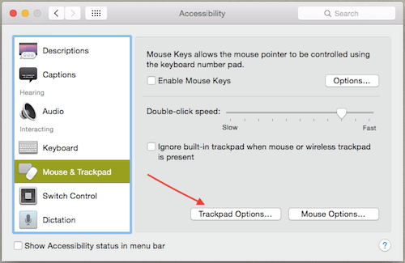

OSX
====

.. figure:: ../pics/apple.png
   :width: 200px
   :align: center

This is my main unix operating system I use daily.

OSX 10.11 El Captain, issues with Homebrew
--------------------------------------------

To regain access to ``/usr/local``

::

	sudo chown $(whoami):admin /usr/local

You also need commandline tools and/or might need to point to them::

	xcode-select --install
	xcode-select --switch /Applications/Xcode.app

I installed the Beta version of Xcode 7 and for some reason had to switch the links to
the real version.

Show hidden files
------------------

::

	defaults write com.apple.finder AppleShowAllFiles False/True

Software Update
---------------

You can use the command line to update your OSX systems remotely:

::

	softwareupdate --install

-l, --list         List packages available
-i, --install arg  Install packages where arg can be:

  -a, --all          All packages
  -r, --recommended  Just the recommended packages

--schedule arg     Setup scheduling downloads, either on or off

OSX Fixes
----------

`Enable One-Finger Tap & Drag <http://www.guidingtech.com/34353/re-enable-mavericks-features/>`__

Step 1: On your Mac, first open the Preferences panel. There, head to the Accessibility option as shown below.

Preferences

Preferences Accessibility

.. image:: ./pics/Preferences-Accessibility.png
   :align: center

Step 2: On the left panel of the next window, scroll down and select the Mouse & Trackpad option. There, click on the Trackpad Options… button.

Mouse and Trackpad

This will bring down an options panel.

Step 3: On this panel, you will notice an interesting option at the bottom named Enable dragging. Check it.

Preferences Enable Dragging

.. image:: ./pics/Preferences-Enable-Dragging.png
   :align: center

This option not only allows you to enable dragging on your Mac’s trackpad, but also lets you activate or deactivate drag lock (when enabled, this means that when you drag a window, you will have to perform one more click in order to deactivate the drag function).

And done! Now whenever you use your Mac’s trackpad, just double-tap on any ‘draggable’ area of a window to move it around.

Stop Safari re-opening windows
------------------------------

Hold the shift key down and open Safari

::

    defaults write com.apple.Safari ApplePersistenceIgnoreState YES
    defaults write com.apple.Preview ApplePersistenceIgnoreState YES

Stopping App Store Downloads
-----------------------------

Pausing downloads is easy, but if you start one and want to cancel it hold Option key and click on cancel.

Useful Software
----------------

My hard drive crashed (29 April 2015) and I had to re-install everything. Oh, a USB drive attached to Airport Extreme as your Time Machine backup doesn't work! When I tried to reinstall from that, it complained about corrupt Time Machine files or some such crap. Connect your drive directly to your computer.

So, here is all the software I had to re-install:

- `Github <https://mac.github.com/>`__
- BitTorrent `Sync <http://www.bittorrent.com/>`__
- `Chrome <https://www.google.com/chrome/>`__
- `Atom <https://atom.io/>`__
- `Beamer <http://beamer-app.com/>`__
- `Dropbox <https://www.dropbox.com/>`__
- `Google Drive <https://www.google.com/drive/>`__

Raspberry Pi Virtualbox VM Setup
---------------------------------

This HOWTO follows the work by `Russell
Davis <http://russelldavis.org>`__ for setting up a cross compiling
environment for the Raspberry Pi. I have modified his instructions to
make them more ROS specific.

If you don't already have Virtualbox and the Extension pack installed
then you'll need to download it from
https://www.virtualbox.org/wiki/Downloads, choosing the correct one for
your platform and also download the Extension Pack from the same page if
you haven't already installed it. Once you have downloaded and installed
Virtualbox+Extension pack for your platform move on to step 2.

1. You can download the Ubuntu iso from the `Ubuntu
   website <http://www.ubuntu.com/download/ubuntu/download>`__

2. Once you have the Ubuntu iso downloaded, start Virtualbox and create
   a new Virtual machine by clicking the New button. Virtualbox will
   then start the Virtual Machine Wizard. Give your VM a name. I suggest
   something like RaspberryPi Development. Choose Linux & Ubuntu from
   the dropdowns (or if you are not going to use Ubuntu as the guest os
   then select whichever distro you are going to use). It should look
   something like this

3. Choose the amount of memory to allocate to the VM, give it 1 or 2 GB
   of ram.

4. Create a virtual harddisk and choose VDI which will be dynamically
   allocated. Make it at least 8GB to hold everything. The harddisk will
   resize dynamically.

5. Click the Create button. You will then be returned to the main
   Virtualbox screen with the VM you have just created highlighted click
   the Settings button.

6. Now open up the setting for the VM you just created. The only setting
   you MUST change:

-  storage
-  networking
-  video

7. Go to the storage tab and click the little CD icon. Add the iso you
   downloaded earlier from Ubuntu. This will only effect this boot
   cycle. After you install Linux, the disk image will automatically be
   removed.

8. Go to the networking tab and ensure NAT is selected so you can see
   the interweb. This will also allow you to install updates and 3rd pa

9. Go to the video tab and sensure 3D acceleration is turned off and
   there is enough video memory for your VM ... I selected 32 MB.

Install Linux
--------------

Now hit start on the Virtualbox screen and install Linux.

If you this error message:

::

    piix4_smbus 0000.00.07.0: SMBus base address uninitialized - upgrade bios or use force_addr=0xaddr

Fix based on work by `Karl Foley <http://finster.co.uk>`__, in a
terminal type:

::

    sudo vi /etc/modprobe.d/blacklist.conf

Add the line blacklist i2c\_piix4 to the end of the file and save

::

    sudo update-initramfs -u -k all
    sudo reboot

Also make sure you have the development tools installed

::

    sudo apt-get install build-essential

Also to reduce the size of the install, I uninstalled office, game, and
other unneeded software.

VM Commands
------------

VBoxHeadless --startvm vb\_ros

VBoxManage controlvm vb\_ros poweroff \| pause \| reset

Networking
----------

In order for your vm to see the internet and other attached vm and
computers, you must use a bridged connection. However on **OSX** the
bridged network doesn't work if you are using a wireless connection
(airport). A real wired connection works fine in OSX (10.8.2 tested).

RPI Tool Chain (Cross compile x86 to ARM)
-----------------------------------------

The Raspberry Pi Foundation is providing a ready-to-use toolchain on
their github repository. You can use it to save yourself some time.

To do so, you need to have git installed and to clone the repository ::

    > sudo apt-get install git-core
    > git clone https://github.com/raspberrypi/tools.git --depth=1
    > export PATH=$PATH:$HOME/tools/arm-bcm2708/gcc-linaro-arm-linux-gnueabihf-raspbian/bin

The "--depth=1" is here to tell git we only want the last revision, and
not the whole history to be cloned.

Create a new file named test.cpp and copy/paste the following code::

    #include <iostream>

    int main(void)
    {
        std::cout<<"Hello ARM world !\n";
        return 0;
    }

Then, enter the following commands::

    > arm-linux-gnueabihf-g++ test.cpp -o test
    > file test
    test: ELF 32-bit LSB executable, ARM, version 1 (SYSV), dynamically linked (uses shared libs), for GNU/Linux 2.6.26, BuildID[sha1]=0xfd72b5c6878433eb7f2296acceba9f648294a58c, not stripped

As you see, you can't execute this program on your PC. The file command
tells you that this executable is built for ARM processors.
