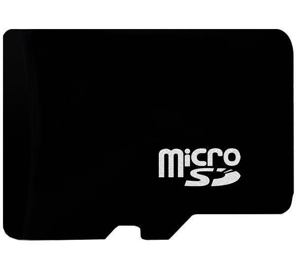

## Install and Setup

[Raspbian](http://www.raspbian.org) is a Raspberry optimized version of Debian. The 
version installed here is based on Debian Wheezy.

	[kevin@raspberrypi ~]$ lscpu
	Architecture:          armv6l
    Byte Order:            Little Endian
	CPU(s):                1
	On-line CPU(s) list:   0
	Thread(s) per core:    1
	Core(s) per socket:    1
	Socket(s):             1

Note this output doesn't really tell you much other than it is ARMv6.

## Copying an image to the SD Card in Mac OS X

These commands and actions need to be performed from an account that has administrator 
privileges.

1. Download the image from a [mirror or torrent](http://www.raspberrypi.org/downloads).

2. Verify if the the hash key is the same (optional), in the terminal run:

    shasum ~/Downloads/debian6-19-04-2012.zip

3. Extract the image:

    unzip ~/Downloads/debian6-19-04-2012.zip

4. Attach the SD Card to the computer and identify the mount point

    df -h

Record the device name of the filesystem's partition, e.g. /dev/disk3s1

5. Unmount the partition so that you will be allowed to overwrite the disk, note that 
unmount is **NOT** the same as eject:

    sudo diskutil unmount /dev/disk3s1

Using the device name of the partition work out the raw device name for the entire disk, 
by omitting the final "s1" and replacing "disk" with "rdisk" (this is very important: 
you will lose all data on the hard drive on your computer if you get the wrong device 
name). Make sure the device name is the name of the whole SD card as described above, 
not just a partition of it (for example, rdisk3, not rdisk3s1. Similarly you might have 
another SD drive name/number like disk2 or disk4, etc. -- recheck by using the df -h 
command both before & after you insert your SD card reader into your Mac if you have 
any doubts!): e.g. /dev/disk3s1 => /dev/disk3

**Note:** Using rdisk3 might be faster than using disk3, need to look into this.

6. Write the image to the card with this command, using the raw disk device name from 
above (read carefully the above step, to be sure you use the correct rdisk# here!):

    sudo dd bs=1m if=~/archlinux-hf-2012-09-18.img of=/dev/disk3

If the above command report an error(dd: bs: illegal numeric value), please change bs=1M 
to bs=1m. 

Note that dd will not feedback any information until there is an error or it 
is finished, information will show and disk will re-mount when complete. However if you 
are curious as to the progresss - ctrl-T (SIGINFO, the status argument of your tty) will 
display some en-route statistics.

7. After the dd command finishes, eject the card:

    sudo diskutil eject /dev/disk3

8. Insert it in the raspberry pi, and have fun
    
## Reconfiguring the Pi (speed and memory)

You can change the Pi's default settings for CPU MHz and memory split (between RAM and
GPU) using `raspi-config`. An alternate way is to simply edit the `/boot/config.txt`.

    [kevin@raspberrypi ~]$ more /proc/cpuinfo
    Processor	: ARMv6-compatible processor rev 7 (v6l)
    BogoMIPS	: 795.44
    Features	: swp half thumb fastmult vfp edsp java tls 
    CPU implementer	: 0x41
    CPU architecture: 7
    CPU variant	: 0x0
    CPU part	: 0xb76
    CPU revision	: 7
    
    Hardware	: BCM2708
    Revision	: 0002
    Serial		: 000000008e0a5a17

    [kevin@raspberrypi ~]$ free -h
                 total       used       free     shared    buffers     cached
    Mem:          232M        57M       174M         0B        11M        28M
    -/+ buffers/cache:        18M       214M
    Swap:          99M         0B        99M

The output here shows overclocked to 800 MHz and the GPU given only 16 MB of RAM. Now
the CPU MHz will change dynamically based on load. So with no load, my 800 MHz system
will default to the original 700 MHz system. If you want to always be running at max
speed, put `force_turbo=1` in the `/boot/config.txt`.

    [kevin@raspberrypi ~]$ more /boot/config.txt 
    #uncomment to overclock the arm. 700 MHz is the default.
    arm_freq=800
    
    # for more options see http://elinux.org/RPi_config.txt
    gpu_mem=16     # can be 16, 64, 128 or 256
    core_freq=250
    sdram_freq=400
    over_voltage=0
    force_turbo=1

More info can be found [here](http://www.raspberrypi.org/documentation/configuration/config-txt.md).

### Backup and Restore
Use the `dd` command to make a full backup of the image:

	dd if=/dev/sdx of=/path/to/image

or for compression:

	dd if=/dev/sdx | gzip > /path/to/image.gz

Where sdx is your SD card and the target could be ~/raspbian_wheezy_`date "+%Y%m%d_%T"`. 
This will save it to your home directory and append the current date and time on the end 
of the filename.

To restore the backup you reverse the commands:

	dd if=/path/to/image of=/dev/sdx

or when compressed:

	gzip -dc /path/to/image.gz | dd of=/dev/sdx 

## Raspi-Config

This is a simple [utility](http://www.raspberrypi.org/documentation/configuration/raspi-config.md) to reconfigure various things on the Pi. You can download it by:

    sudo apt-get raspi-config
	sudo raspi-config

Suggest selecting the advanced choice first so you can update raspi-config script first, just to make sure you have any bug fixes, 
then run the resize option. You can change:

* timezone (use internationalization option)
* hostname
* user password
* resize SD memory card
* configure sound through HDMI or 3.5 mm jack

## Sound

Sound is still experimental, but can be enabled in the current session by:

	sudo apt-get install alsa-utils
	sudo modprobe snd_bcm2835
	sudo aplay /usr/share/sounds/alsa/Front_Center.wav
 
To make the changes permanent for the next reboot, ensure the module is initialized on 
boot, add snd_bcm2835 to `/etc/modules`

Also make sure you are part of group audio:

	sudo gpasswd -a kevin audio

This will allow you to play audio commands without being root (via sudo). 

The audio output will be set to `automatic`, but can be changed:

	sudo amixer cset numid=3 n

where `n` is 0=auto, 1=headphones, or 2=hdmi.

